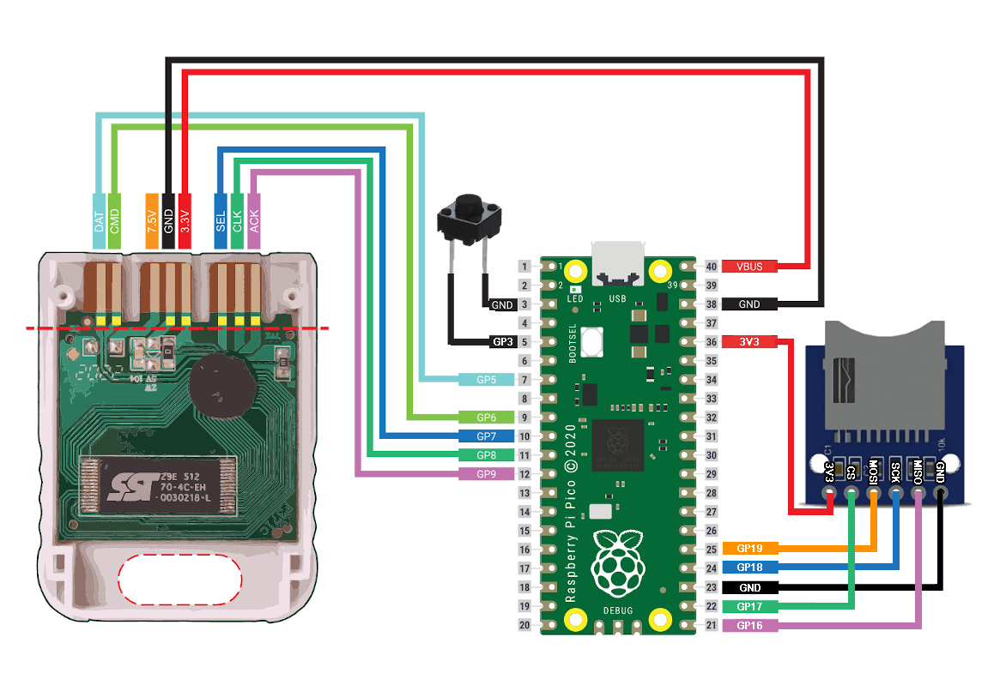
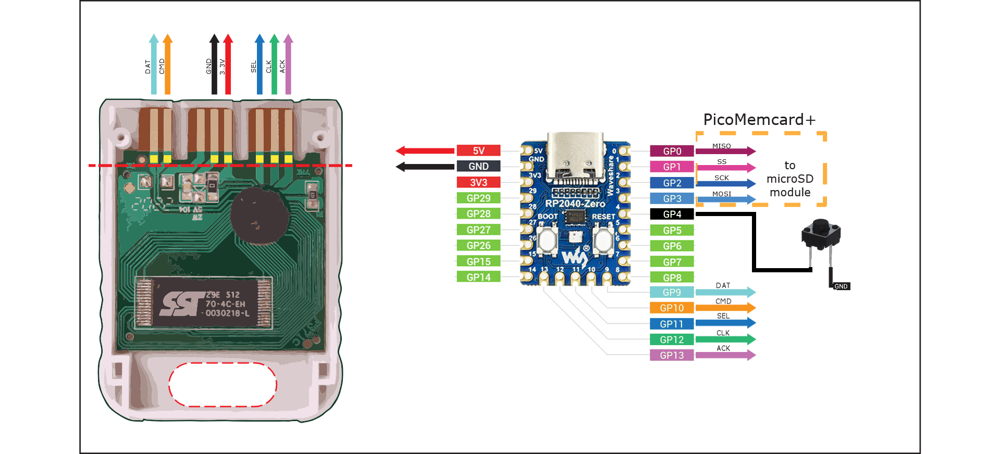

#Read Here First
                                                          
                                                         PicoMemcard-Rewired
 This project is a simple rewire , or maybe a Re-pinned version , of the project #PicoMemcard – Simplified Fork (Button + WS2812 Edition) ,
 it simply aim to take alberonisse project (Button + WS2812 Edition) and repinned it to comply with the original pin set from 
 https://github.com/dangiu/PicoMemcard or simply dangiu's original project cause i have already my Pico mmc Board and i don't want to trash
 my old PCB cause alberonisse like other pin instead the original.
 Before doing anything stupid check the wiring of your project if it comply with Dangiu's original schematic ,
 then remember it remove the controller combination and add a phisical button on 
 pin 3 and pin Gnd for Raspberry pi pico , 
 and 
 pin 4 and pin Gnd for Rp2040.

                               Below is the original document , i have to change the schematic a soon as possible

This project depends directly from the fork Modified and maintained by **Alber Multi House**.

#PicoMemcard – Simplified Fork (Button + WS2812 Edition)

This project is a simplified and hardware-oriented fork of the original PicoMemcard by Daniele Giuliani.

This version focuses on standalone operation using a physical button and WS2812 RGB LED, removing controller-based commands and simplifying memory card management.

It emulates a PlayStation (PSX) Memory Card using a Raspberry Pi Pico or RP2040-Zero and allows save management directly via USB Mass Storage.

---

## Main Differences from Original PicoMemcard

- Physical button replaces controller input
- Automatic memory card creation
- Any `.MCR` filename supported
- Persistent last selected card
- WS2812 RGB LED status system
- Simplified firmware architecture
- Designed for RP2040 Zero and Pico
- No controller combo required
- Optimized SD card workflow
- Focused on reliability and simplicity

---

## Features

- Faithful PSX Memory Card emulation
- USB Mass Storage access to SD card
- Automatic creation of first memory card
- Supports multiple `.MCR` images
- Physical button control:
  - Short press → switch memory card
  - Long press (5 seconds) → create new memory card
- Remembers last selected card
- WS2812 RGB LED feedback
- SD card storage (SPI)
- Works on PSX and PS2 (PSX memory mode)

---

## Hardware Requirements

- Raspberry Pi Pico or RP2040-Zero
- SPI MicroSD module
- WS2812 RGB LED
- Push button
- PSX Memory Card connector or controller cable

---

## Button Control

| Action | Function |
|--------|----------|
| Short press | Switch to next memory card |
| Hold 5 seconds | Create new empty memory card |

---

## Memory Card Files

- Must be exactly **128KB (131072 bytes)**
- Must use `.MCR` extension
- Any filename allowed (example: `game1.mcr`, `slot2.mcr`)

Behavior:

- If no `.MCR` exists → firmware creates one automatically
- Last selected card is saved to `selectMC.txt`
- On boot, previously selected card is restored

---

## LED Status and Error Codes

The firmware provides visual feedback using:

- **RP2040-Zero:** WS2812 RGB LED  
- **Raspberry Pi Pico:** onboard single-color LED (green)

Because Raspberry Pi Pico has no RGB LED, colors below apply only to RP2040-Zero.  
On Pico, all states are represented by LED ON/OFF or blinking.

---

### Normal Operation

### RP2040-Zero (WS2812 RGB)

| Color | Meaning |
|------|---------|
| Off | Idle |
| Orange solid | Writing / syncing memory card |
| Blue blinking | Switching memory card |
| Green triple blink | New memory card created |

### Raspberry Pi Pico (single LED)

| LED | Meaning |
|-----|---------|
| Off | Idle |
| Solid ON | Writing / syncing |
| Fast blinking | Switching memory card |
| Triple blink | New memory card created |

---

### Error Codes (Red Blinking / Pico blinking)

When a critical error happens:

- RP2040-Zero blinks **RED**
- Raspberry Pi Pico blinks its onboard LED

The number of blinks represents the error code.

| Blinks | Error |
|--------|------|
| 1 | SD card not detected / mount failed |
| 2 | Maximum number of memory cards reached |
| 3 | File write error |
| 4 | File read error |
| 5 | File open error |
| 6 | Failed creating new memory card |
| 7 | Invalid memory card size |
| 8 | Memory card not initialized |
| 9 | Bad parameter |

Behavior:

- LED turns on
- Waits ~2 seconds
- Blinks N times
- Repeats forever

This allows diagnosing problems without USB or serial output.

---

### Important

If LED stays ON (or orange on RP2040-Zero) for too long, do NOT power off the console.

Wait until LED turns off before shutting down to avoid save corruption.

## LED Status and Error Codes

The firmware uses LED feedback (WS2812 on RP2040-Zero, onboard LED on Raspberry Pi Pico) to indicate all runtime states.

### Normal Operation

| LED | Meaning |
|-----|---------|
| Off | Idle |
| Orange solid | Writing / syncing memory card data |
| Blue blinking | Switching memory card |
| Green triple blink | New memory card created |

---

### Error Codes (Red Blinking)

When a critical error happens, the LED will blink RED.

The number of blinks represents the error code.

| Blinks | Error |
|--------|------|
| 1 | SD card not detected / mount failed |
| 2 | Maximum number of memory cards reached |
| 3 | File write error |
| 4 | File read error |
| 5 | File open error |
| 6 | Failed creating new memory card |
| 7 | Invalid memory card size |
| 8 | Memory card not initialized |
| 9 | Bad parameter |

Behavior:

- Red LED turns on
- Pauses ~2 seconds
- Blinks N times
- Repeats forever

This allows diagnosing problems without USB or serial output.

---

### Important

If LED stays orange for too long, do NOT power off the console.

Wait until LED turns off (or green on Pico) to avoid save corruption.

---

## SD Card

- exFAT formatted
- Uses SPI interface
- All `.MCR` files must be in root directory

---

## Firmware Installation

1. Hold BOOTSEL on Pico / RP2040
2. Plug USB
3. Drag UF2 firmware
4. Device appears as USB Mass Storage
5. Copy `.MCR` files to SD card

---

## Wiring Diagrams

These diagrams show the physical wiring for both supported boards.

### Raspberry Pi Pico

---

### RP2040-Zero

---

Both boards use the same PSX bus signals, only LED implementation differs:

- RP2040-Zero uses WS2812 RGB
- Raspberry Pi Pico uses onboard LED

Button is shared on both boards and provides:

- Short press → switch memory card
- Long press (5 seconds) → create new memory card

## Important Warning

Never power PicoMemcard from USB while connected to PSX.

This will feed 5V into the console’s 3.3V rail.

If debugging via USB, disconnect VBUS from PSX.

---

## Project Philosophy

This fork prioritizes:

- Hardware simplicity
- No controller dependency
- Direct physical interaction
- Reliability over feature complexity
- Embedded-friendly design

It is intended for real installations inside memory card shells or custom enclosures.

---

## License

GPL-3.0 (same as original PicoMemcard)

This project is a derivative work of PicoMemcard by Daniele Giuliani.

Original repository:
https://github.com/dangiu/PicoMemcard

---

## Credits

Original PicoMemcard:
Daniele Giuliani

PSX protocol documentation:
Martin Korth (NO$PSX)
Andrew J. McCubbin

FatFS:
ChaN

TinyUSB:
Ha Thach

---

## Author

Alber Multi House  
Brazil – 2026  

Simplified Fork Edition
